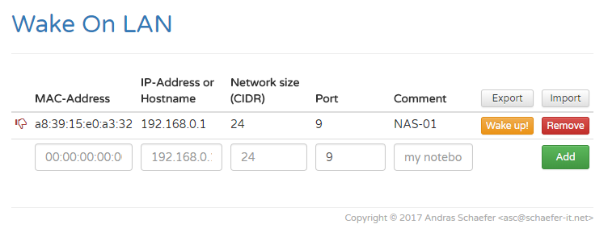

# wake-on-lan.php
Send magic packet from php to wake up a host using "Wake on Lan"



```wake-on-lan.php``` started as a ___one file drop in___ tool for waking up computers when they are suspended.

_Note_:
As there where numerous issues using this code, even it worked fine in my environment, at the end of 2021 i decided to refactor the whole thing.


# Changes of the 2021 Release


  * Now it is _really_ a __one file drop in__.
  * Version update for _bootstrap_ and _jquery_.
  * Configuration is now saved to the backend. (Make sure web server can write to it.)
  * Host check is now done via connection test to _ssh_, _rdp_, _http_ and _https_.
  * MAC address can now be typed in using dash (-) or colon (:) - both will work.
  * No longer requires the raw-Sockets feature. All is done via the sockets extension in php.


# Requirements
* PHP5 or PHP7
* Internet connection for CDN includes (.js, .css)
* Sockets extension must be enabled
* Web server must be allowed to write to the file ``config.json``


# Installation
* Either clone the repository or download the zip file
* Copy the file ```wake-on-lan.php``` to a directory on your web server

_Note_: If you need to copy the file to a remote machine use ``scp`` or ``sftp``.


# Enabling the php sockets extension
The way the php sockets extension is enabled slidely differes with every php installation.

Here are basic steps for linux users:

  * Go to the directory that contains your ``php.ini``file.
  * Open the file with text editor
  * Search for the line ``;extension=sockets``
  * Remove the trailing semicolon (;) to enable this feature.
  * Save your ``php.ini``file
  * Reload your webserver configuration.


# Setup
Open your favorite browser and navigate to the ```wake-on-lan.php``` url.
Now you can start adding your the hosts you want to wake.

# General Operation

## Adding a host
To add a host simply fill the edit fields at the bottom of the table and press the blue button with the plus sign.

You need to fill the follwing input fields:

  * _Mac-Address_ - Type the mac address of the host you wish to wake. The values can be separated by a dash (-) or a colon (:) - both will work.
  * _IP-Address_ - Type the ip address of the host. This is required to query the "host up" state and calculate the broadcast address of the magic packet.
  * _Subnet Size_ - type in the subnet size in CIDR notation. 


## Removing a host
To remove a host simply click on the trashcan icon of the host you want to remove.


## Saving the configuration
You can save the configuration by choosing _Tools_ -> _Save COnfiguration_.

The configuration will be saved to a json file in the same directory as of ```wake-on-lan.php```.

The web server needs permission to write to the file. You you may need to adjust folder permission accordingly.

# Tools Dropdown Menu

* _Download Configuration_ - This will download the ``config.json``file to your computer.

* _Export Configuration_ - open a modal window with the configuration as a json file. Copy the contents of the edit window and save the configuration as a file.

* _Import Configuration_ - open a modal window with a text box. Paste your configuration into the text box and click on __Import__.

* _Load Configuration_ - Load the configuration from the ``config.json``file from the web server.

* _Save Configuration_ - Save the configuration to the file ``config.json`` on the web server. Make sure the web server process is allowed to write to the file.


* _Wake up!_ - send a magic packet for the selected host.

* _Remove_ - delete the row from the configuration. The data of the deleted row is placed in the input fields for adding a new host. If you accidently removed a host you can simply press _Add_ again to add it again.
* _Add_ - adds a new entry to the table. Fill in the text boxes and press _Add_.


# Caveat

  <s>Does not run under linux. Because the linux user used to run php code on the server side usually has very limited permission it cannot create the raw socket to send the magic packet.</s>

__Note__: This caveat no longer applies. Using the sockets extension ```wake-on-lan.php``` no longer suffers this shortcoming.

# License
```wake-on-lan.php``` is published under [MIT](LICENSE) license.
