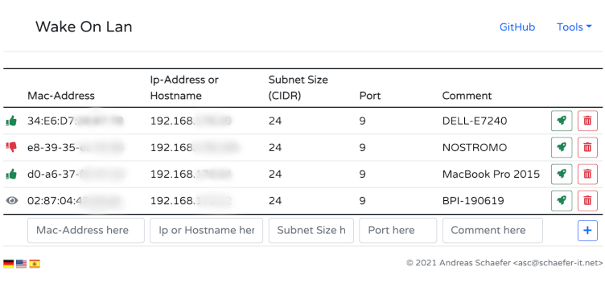

# wake-on-lan.php
Send magic packet from php to wake up a host using "Wake on Lan"



```wake-on-lan.php``` started as a ___one file drop in___ tool for waking up computers when they are suspended.


# Requirements
* Windows Operation System
* XAMPP or IIS
* PHP5 or PHP7
* Internet connection for CDN includes (.js, .css)

# Installation
* Either clone the repository or download the zip file
* Copy the file ```wake-on-lan.php``` to a directory on your web server.


# Setup
Open your favorite browser and navigate to the ```wake-on-lan.php``` url.
Now you can start adding your the hosts you want to wake.

* _Export_ - open a modal window with the configuration as a json file. Copy the contents of the edit window and save the configuration as a file.

* _Import_ - open a modal window with a text box. Paste your configuration into the text box and click on __Import__.

* _Wake up!_ - send a magic packet for the selected host.

* _Remove_ - delete the row from the configuration. The data of the deleted row is placed in the input fields for adding a new host. If you accidently removed a host you can simply press _Add_ again to add it again.
* _Add_ - adds a new entry to the table. Fill in the text boxes and press _Add_.


# Caveat
Does not run under linux. Because the linux user used to run php code on the server side usually has very limited permission it cannot create the raw socket to send the magic packet.

# License
```wake-on-lan.php``` is published under [MIT](LICENSE) license.
